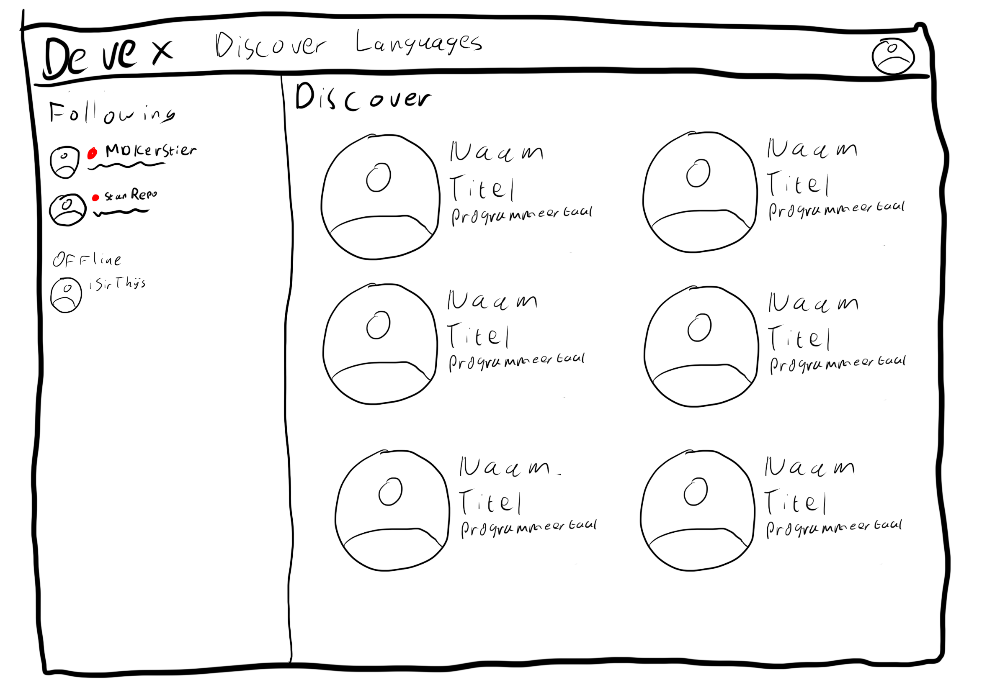
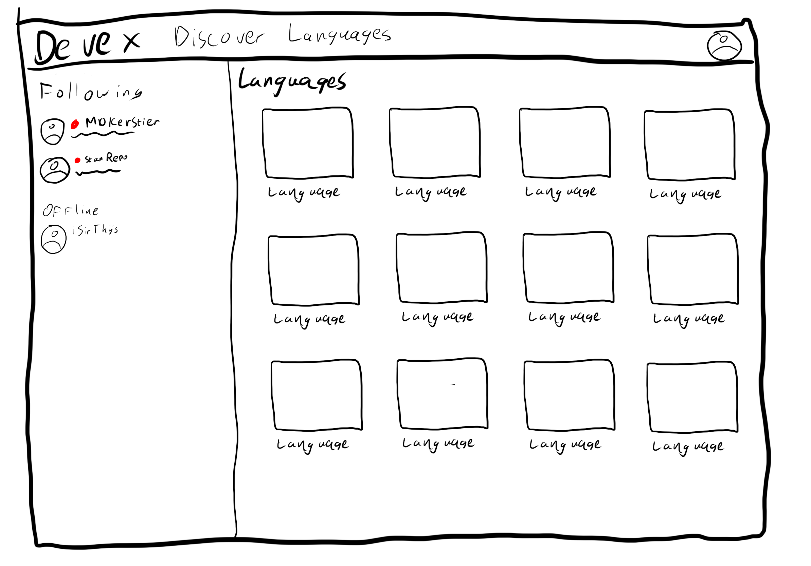
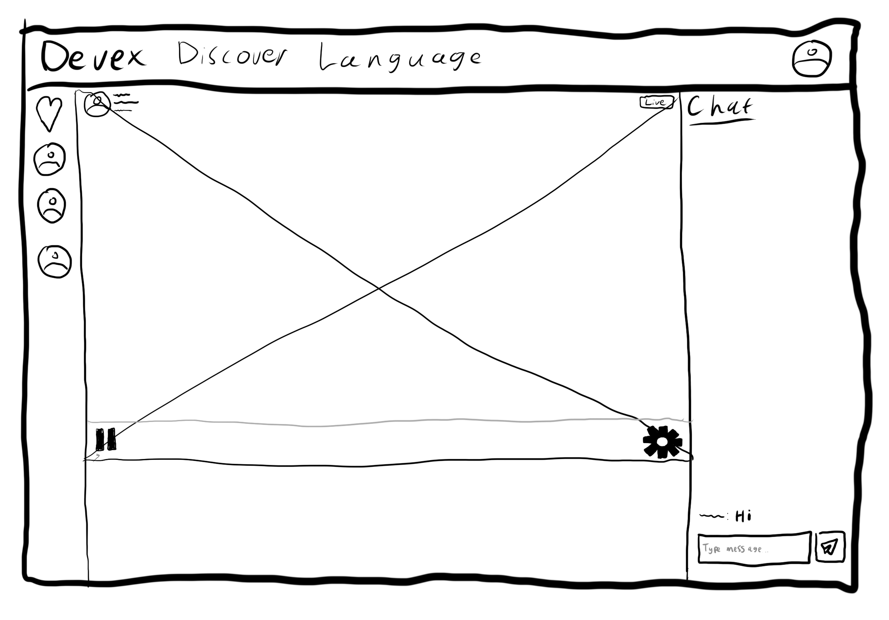
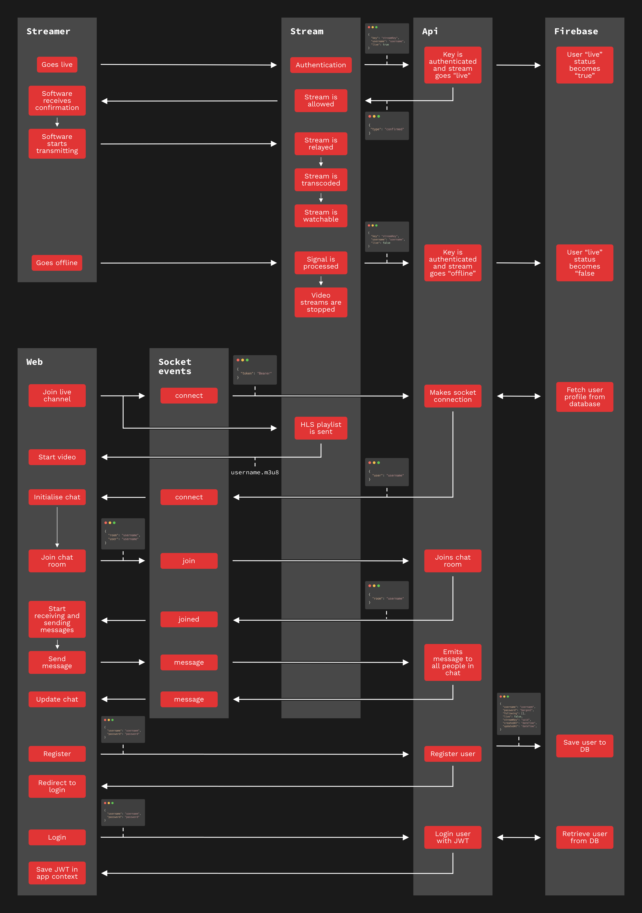

# DevEx

The built-from-scratch live-streaming platform for all developers. Share your coding sessions live to the world for the world to enjoy.

## Table of contents

- [Getting started](#getting-started)
  - [Project setup](#project-setup)
  - [Available commands](#available-commands)
- [Tech stack](#tech-stack)
- [Features](#features)
  - [Wishlist](#wishlist)
- [Sketches](#sketches)
- [Data lifecycle](#data-lifecycle)

## Getting started

This project uses workspaces, and prefers [Yarn classic](https://classic.yarnpkg.com/lang/en/) over NPM. Both are however usable within this project.

```shell
$ git clone https://github.com/theonejonahgold/real-time-web-2021 rtw
$ cd rtw
$ yarn || npm install
```

### Project setup

This repository consists of two packages: `web` and `server`. The `web` package is responsible for the web application that the user sees. The `server` package is a Node application handling all data used in the application via HTTP, WebSockets and RTMP streams.

```
└─ real-time-web-2021
   ├─ docs - Documentation folder.
   ├─ server - NodeJS app.  
   └─ web - Web app.
```

### Available commands

```shell
$ yarn dev # Runs dev server for both packages.
$ yarn build # Builds both packages.
$ yarn lint # Runs Prettier without writing fixes.
$ yarn format # Formats files with incorrect syntax.
```

## Tech stack

- TypeScript
- Prettier
- Commitizen
- Commitlint
- Husky
- Docker

### Server package

- NodeJS
- KoaJS
- Firebase Firestore and Storage
- Socket.IO
- RTMP-server
- HLS-server
- FFmpeg
- Passport.JS
- Argon2

### Web package

- Svelte
- Socket.IO

## Features

- [x] Register.
- [x] Log in. 
- [x] Live stream video from broadcasting software like OBS.
  - [x] Authenticate your stream with a stream key.
- [ ] View streams.
- [ ] Chat on other people's streams.
- [ ] Follow other profiles.
  
### Wishlist

- Persistent chat message storage.
- Video on-demand (VOD) functionality.
- Emotes.
- Chat moderators.

## Sketches



The Discovery has a list of channels that are live. In the always-present sidebar you can see your followed channels. And watch them from anywhere.



The Languages page shows all programming languages, so you don't have to sift through programming languages you don't like to watch.



The Stream page shows a live stream, with the corresponding chat next to it.

## Data Lifecycle


