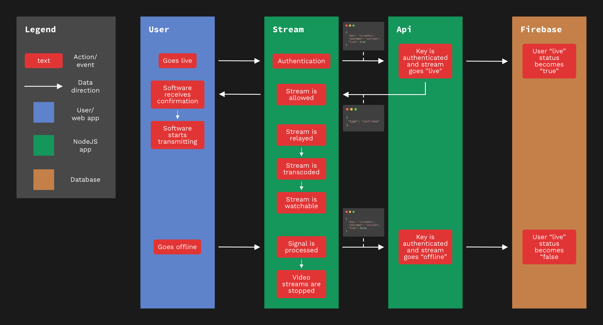

# DevEx

The built-from-scratch live-streaming platform for all developers. Share your coding sessions live to the world for everyone to enjoy!

## Table of contents

- [Getting started](#getting-started)
  - [Install the project](#install-the-project)
  - [Project setup](#project-setup)
  - [Available commands](#available-commands)
- [Tech stack](#tech-stack)
  - [API package](#api-package)
  - [Stream package](#stream-package)
  - [Web package](#web-package)
- [Features](#features)
  - [Must haves](#must-haves)
  - [Should haves](#should-haves)
  - [Could haves](#could-haves)
  - [Would like to haves](#would-like-to-haves)
- [Sketches](#sketches)
- [Data lifecycles](#data-lifecycles)
- [Socket events](#socket-events)
  - [Following namespace](#follow-namespace)
  - [Watch namespace](#watch-namespace)
  - [Chat namespace](#chat-namespace)
  - [Me namespace](#me-namespace)
- [What I've learned](#what-ive-learned)

## Getting started

This project uses workspaces, and prefers [Yarn classic](https://classic.yarnpkg.com/lang/en/) over NPM as its package manager. For the best developer experience, use [Docker][docker] so you don't have to install [FFmpeg][ffmpeg] locally and setup environment variables yourself.

This project also uses [Firebase](https://firebase.google.com). After you've set-up the project, create a Firebase app, add a service account for the Firestore and put the downloaded JSON file inside the `api` folder as `firebase.json`. Docker will do the rest. If you've never worked with Firebase before, [get started here](https://firebase.google.com/docs/guides).

### Install the project

```shell
$ git clone https://github.com/theonejonahgold/real-time-web-2021 rtw
$ cd rtw
$ yarn || npm install
```

### Project setup

```
└─ real-time-web-2021
   ├─ api - NodeJS CRUD api for 'web' and 'stream' packages.
   ├─ docs - Documentation folder.
   ├─ stream - Node-media-server for ingesting RTMP streams and processing them to HLS.
   └─ web - The web app you see at https://devex.jonahgold.dev.
```

### Available commands

```shell
$ yarn dev:up # Runs 'stream' and 'api' packages in docker and web outside of it due to a bug with SvelteKit.
$ yarn dev:down # Shuts down docker containers for 'stream' and 'api'
$ yarn prod # Run all packages inside of docker (for production).
$ yarn format # Run prettier to format all project files.
$ yarn lint # Run prettier to check formatting on all files.
```

These commands are available from the root of the project, but every package has their own `build`, `dev` and `start` script as well.

## Tech stack

- [Docker][docker]
- [NodeJS](https://nodejs.org)
- [TypeScript](https://typescriptlang.org)
- [Prettier](https://prettier.io)
- [Commitizen](https://commitizen.github.io/cz-cli/)
- [Commitlint](https://commitlint.js.org/)
- [Husky](https://typicode.github.io/husky/)

### API package

- [KoaJS](https://koajs.com)
- [Firebase Firestore](http://firebase.google.com)
- [Socket.IO](https://socket.io)
- [Passport.JS](http://www.passportjs.org)
- [Argon2](https://github.com/ranisalt/node-argon2#readme)

### Stream package

- [Node Media Server][nms]
- [Node Fetch](https://github.com/bitinn/node-fetch)
- [FFmpeg][ffmpeg]

### Web package

- [Svelte](https://svelte.dev)
- [Socket.IO](https://socket.io)
- [HLS.js](https://github.com/)
- [SvelteKit](https://kit.svelte.dev)
- [PostCSS](https://postcss.org)

## Features

### Must haves

- [x] Register.
- [x] Log in.
- [x] Live stream video from broadcasting software like OBS.
  - [x] Authenticate your stream with a stream key.
- [x] View streams.
- [x] Chat on other people's streams.

### Should haves

- [x] Follow other profiles.
- [x] Set stream title.
- [x] Set programming language.
- [x] Discover live channels on programming language.
- [x] Have a stream thumbnail.
- [x] Have a nice onboarding experience.

### Could haves

- [ ] Profile search
- [x] Show when someone you follow is live or offline.
- [x] Show something when there is nothing to show on pages.
- [ ] Chat emotes.
- [ ] Follow notifications in chat.

### Would like to haves

- [ ] Dynamically cap resolution based on incoming stream.
- [ ] Chat moderators.
- [ ] Persistent chat message storage.
- [ ] Video on-demand.

## Sketches


The Discovery has a list of channels that are live. In the always-present sidebar you can see your followed channels. And watch them from anywhere.


The Languages page shows all programming languages, so you don't have to sift through programming languages you don't like to watch.


The Stream page shows a live stream, with the corresponding chat next to it.

## Data Lifecycles

### For live streaming



### For website


## Socket events

Socket events are spread over four namespaces:

1. Following namespace: For handling updates for the channel you follow. This makes the "Following" sidebar real-time.
2. Watch namespace: For handling updates of the channel you're watching. Viewer count, live status, stream title and programming language are all updated real time through this namespace.
3. Chat namapsace: This namespace handles the chat data flows, making the chat experience real-time and easy to use.
4. Me namespace: When you update something about your own profile, this namespace ensures that these changes are sent back to the web app immediately after they're saved, so you have the most up-to-date version of your own profile available locally.

### Following namespace

<details>
  <summary>API: <code>update</code></summary>
  Is sent when a user object that's been followed is updated.
</details>

<details>
  <summary>Web: <code>update</code></summary>
  Is sent when the logged in user's following list has been updated.
</details>

### Watch namespace

<details>
  <summary>Web: <code>join</code></summary>
  Is sent when a socket connection has been established. The event is sent with the <code>channel</code> that the user is watching.
</details>

<details>
  <summary>API: <code>update</code></summary>
  Is sent when the user being watched has been updated inside the database in some way. The <code>viewers</code> count, <code>live</code> status, <code>streamTitle</code> and programming <code>language</code> are the four keys that are sent, along with the username.
</details>

### Chat namespace

<details>
  <summary>Web: <code>join</code></summary>
  Is sent when the user joins a chat. The chat <code>room</code>, along with the <code>username</code>, is sent as payload for the API to handle.
</details>

<details>
  <summary>Web: <code>message</code></summary>
  Is sent when the user sents a chat message. A chat message can be sent without being logged in (not via the website without tinkering), but will not be sent to all other users in the chat as the user is authenticated before the message is sent.
</details>

<details>
  <summary>API: <code>message</code></summary>
  Either <code>user</code> or <code>server</code> type. With user messages the user is authenticated first, every message, to prevent messaging from spammers. The server messages are for announcements and welcome messages, and are now only sent when a connection is established.
</details>

### Me namespace

<details>
  <summary>API: <code>update</code></summary>
  Is fired when the user object in the database has been updated in some sort of way, sending this new version to the client.
</details>

## What I've learned

For me, the biggest hurdle with this project was figuring out how to make it possible to use software like [OBS](https://obsproject.org) to transmit your live stream to DevEx. What I came across was [Node media server][nms], a package tailor-made to ingest, transcode and then publicate the transcode(d) stream(s) for the world to see. There is almost no documentation on how to use this package, so I had to look online for implementations of it in the way that was usable to me.

Luckily, a GitHub user by the name of [johndavedecano](https://github.com/johndavedecano/) had a repository called [node-rtmp-hls](https://github.com/johndavedecano/node-rtmp-hls/), which is exactly what I needed. What I've learned was that software like OBS transmit an [RTMP](https://en.wikipedia.org/wiki/Real-time_Messaging_Protocol) stream, which is a relic from the flash player days and was used to transmit real-time data to and from flash players from a server. This was used in the early days of live streaming, before HTML5 video waas popularised, as it was the only way to reliably watch a live stream (I think, this is pure speculation). Since Flash has gone, Apple has come with [HLS](https://en.wikipedia.org/wiki/HTTP_Live_Streaming), which is their counter-point to RTMP, and works over regular HTTP. This means that I can use the configuration John made for his repository, and use it myself! Although I had no clue what everything did until I did some more learning. And some learning I did.

I learned about RTMP, HLS, how the Node-Media-Server package works and how the configuration John made turns one RTMP stream into multiple HLS streams. The [Config file](https://github.com/theonejonahgold/real-time-web-2021/blob/main/stream/src/config.ts) has two main keys that are very important, `relay` and `trans`, standing for "relay" and "transcode" repectively. The `relay` key tells the `stream` app ([rtmp://devex.jonahgold.dev/stream](rtmp://devex.jonahgold.dev/stream)) to push all video coming in to the `hls_360p`, `hls_480p`, `hls_720p`, `hls_1080p` apps. These apps are all transcoders, meaning they mold incoming video into a certain output. This is done with [FFmpeg][ffmpeg], the most versatile tool for basically turning every form of video into every form of video or audio you want. FFmpeg takes the RTMP stream coming in from `stream`, and outputs it into the settings provided by each "app". This is in turn written to disk, but that's not where the party ends.

Now we have 4 separate streams (or 2 as I've commented out the 720p and 1080p streams). These streams need to come together in some way, so the video player in your browser knows about all the possible resolutions to choose from. This is done in what's called a "HLS playlist". Every resolution has one of their own, and the code in [playlist.ts](https://github.com/theonejonahgold/real-time-web-2021/blob/main/stream/src/playlist.ts) creates one for all resolutions, making it possible to digest all stream resolutions from one file only.

When I found out how this all worked, my mind started racing with possible features. That's why I've made a [thumbnail](https://github.com/theonejonahgold/real-time-web-2021/blob/main/stream/src/thumbnail.ts) feature, creating thumbnails for all live streams every minute. I didn't create the command myself, as I have no idea which options FFmpeg has, but I can explain what it does after seeing it in action.

Small fun fact: apparently only Safari supports HLS natively, but every other browser can support it with what's called [Media Source Extensions](https://en.wikipedia.org/wiki/Media_Source_Extensions). The [HLS.js][hlsjs] I used for the web app is such an extension, and adds HLS support to a lot more browsers (plus improving the one in Safari with quality level selection and more video events).

### In short

So, what have I learned the most:

- What the RTMP and HLS protocols are.
- How the node-media-server package turns 1 RTMP stream into 4 HLS streams in multiple resolutions.
- How to use this knowledge to think of featuers myself.
- That a lot of the live streaming platforms still rely on old protocols from when they first started.
- HLS is only supported in Safari, but very easy to implement in other browsers.

## Special thanks

- Justus Sturkerboom and Lukas van Driel from [Real-Time Web](https://github.com/cmda-minor-web/real-time-web-2021) for allowing me to experiment with this amazing concept.
- Lukas van Driel especially for being a good coach, providing me with very helpful feedback each week.
- Student-assistant Robin Frugte
- [Victor](https://github.com/bvictorb), [Guus](https://github.com/tsjuusmei), [Roeland](https://github.com/roelandvs), [Vincent](https://github.com/Vincentvanleeuwen) & Evelyn for providing me with very good usability feedback!
- Evelyn again, for her patience and mental support.
- Squid Squad A for being the best squad.
- [John](https://github.com/johndavedecano/) for providing such a helpful template to work off of.
- [Chen](https://github.com/illuspas) for creating Node-Media-Server.
- Destek from [StackOverflow](https://stackoverflow.com/a/57791778) for providing the FFmpeg command to generate thumbnails from an HLS stream.

All other sources used documentation, which I've documented in the [Tech stack](#tech-stack) section.

[docker]: https://docker.com
[ffmpeg]: http://ffmpeg.org
[nms]: https://github.com/illuspas/Node-Media-Server
[hlsjs]: https://github.com/video-dev/hls.js
